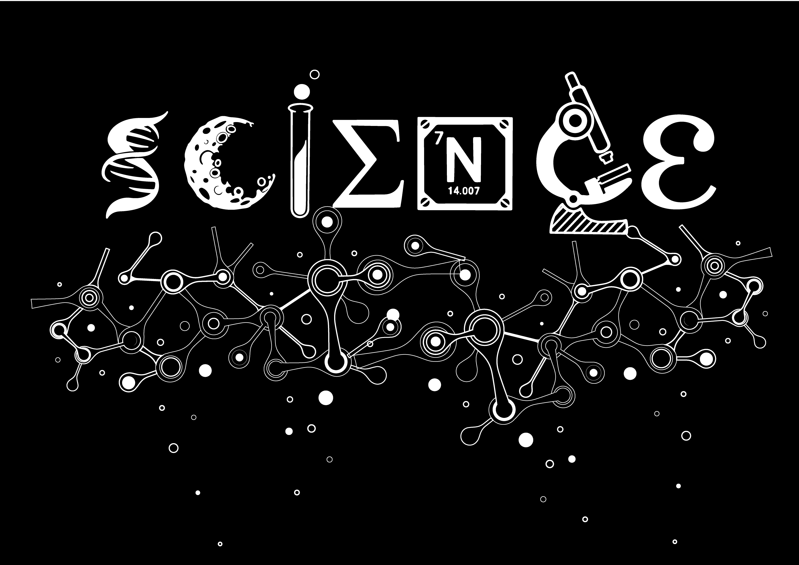

# LaTeX 祕笈

	
	</img>

## 緣起 Origin

### 故事 Story

這是一個來自武陵科學班的資訊貓貓的故事。

在某個星期二晚上，他偶然參加了武陵數學讀書會。那天，是他正式開始接觸LaTeX的第一天。

於是，正當他決定深入研究LaTeX時，卻發現了許多令人失望的事實。

而這也促使他召集更多身邊的好朋友，一同進行這次的專案...

### 動機 Motive

國際上許多學術論文及教科書的排版都使用LaTeX作為排版引擎，因此學習LaTeX是個實用的技能。

然而，LaTeX的語法和大部分套件 *(Package)* 的官方技術文檔 *(Official Documentation)* 均只提供英文版本，因此LaTeX在華語圈非常不普及。
網路上所搜尋到的中文LaTeX教學少之又少，大多不是年代久遠的產物，就是零散的幾篇文章。由於缺乏系統化的統整，非常不利於初學者入坑。:(

## 專案簡介 Summary

本專案試圖全程以LaTeX編出一份精美的LaTeX教學講義，並將原始碼 *(Source Code)* 完整公開。

### 目標 Objective

本專案欲達成的目標如下：

- 以教學式的講義，帶領讀者從零開始學習LaTeX。
- 將LaTeX語法與套件包的技術文件翻譯成中文版，以供社群參考。

### 目錄 Table of Contents

#### Part I 前言

##### 第一章 LaTeX簡介

#### Part II LaTeX入門

--待續 TO BE CONTINUED--

## 工作人員 Contributors

- 專案發起人 Project Director: GPwaob_92679 (GitHub: [@gpwaob92679](https://github.com/gpwaob92679))

- 作者群 Authors
	- 作者 Author: GPwaob_92679 (GitHub: [@gpwaob92679](https://github.com/gpwaob92679))
	- 作者 Author: Icelin1717 (GitHub: [@Icelin1717](https://github.com/Icelin1717))

- 美術設計群 Art Designers
	- 頁尾逐格動畫設計 Animation Design: Icelin1717 (GitHub: [@Icelin1717](https://github.com/Icelin1717))
	- 美編 Artworks: sakurajima0207 (GitHub: [@sakurajima0207](https://github.com/sakurajima0207))
	
## 外部連結  External Links

### LaTeX

- [LaTeX Project Official Site](https://www.latex-project.org/)
- [MiKTeX Project Page](https://miktex.org/)
- [TeX - LaTeX Stack Exchange](https://tex.stackexchange.com/)
- [Documentation - Overleaf, Online LaTeX Editor](https://www.overleaf.com/learn)
- [LaTeX - Wikibooks, open books for an open world](https://en.wikibooks.org/wiki/LaTeX)
- [CTAN: Comprehensive TeX Archive Network](https://www.ctan.org/)

### 
